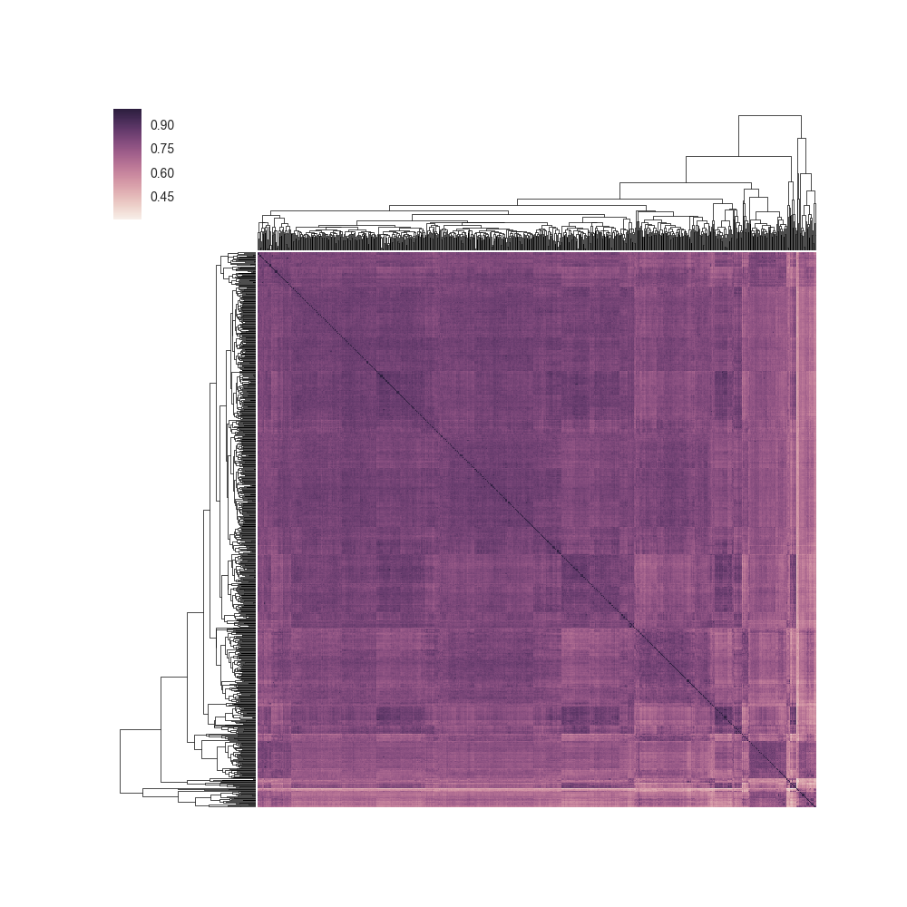
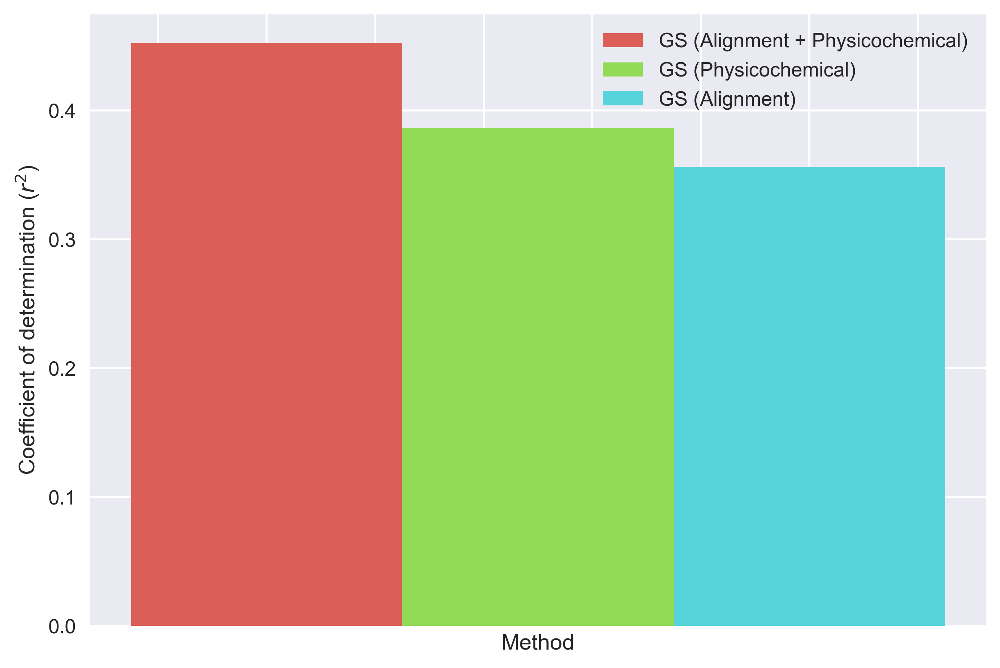
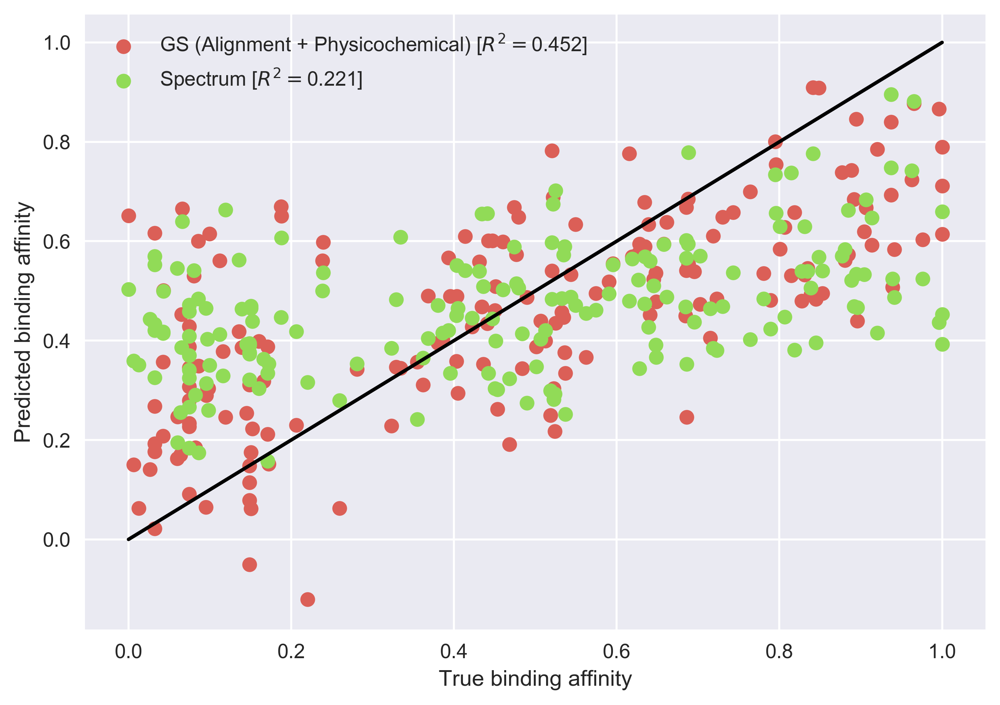

<a href="../../#table-of-contents"><-- Back to table of contents</a>

# Application: peptide protein binding affinity prediction

In this part of the tutorial, we will cover an application of kernel methods to predicting the binding affinity of peptides to the MHC-II. We will use data from the work of Giguère et al. (2013)

## Kernels

A kernel is a function that **measures the similarity** between two learning examples. Such functions must have some strict mathematical properties, which go beyond the scope of this tutorial ([see here](https://en.wikipedia.org/wiki/Kernel_method#Mathematics:_the_kernel_trick)). For our purpose, it is sufficient to know that:

1. Kernels can be designed to compare **complex data structures** (e.g., images, DNA/protein sequences, etc.).

2. The similarity measures can be based on relevant **domain knowledge**. For instance, when comparing **amino acid sequences**, it might be relevant to account for their **physicochemical properties**.

3. Like the polynomial features that we used in the previous section, they allow to **learn non-linear functions** using **linear models**.

Hence, they essentially allow the application of some machine learning algorithms (e.g., support vector machines, ridge regression, principal component analysis, etc.) to very complex data structures.


## Demonstration

In this example, we will model the binding affinity of short peptides and the MHC-II. We will use [Support Vector Regression](http://scikit-learn.org/stable/modules/generated/sklearn.svm.SVR.html), a regression learning algorithm, combined with a kernel for peptide sequences: the **generic string kernel** (Giguère et al., 2013). The latter measures the similarity between peptides based on:

1. An **alignment** of their substrings

2. The **physicochemical properties** of their constituent amino acids


Lets begin the demonstration. First, have a look at the data by running the following command.

```bash
head ./data/peptide/DRB1_0701.dat
```
This will print the first 10 learning examples. The format is `MHC_ALLELE PEPTIDE BINDING_AFFINITY`.

Now, we will use these data to train the learning algorithm. Run the following command.

```bash
make applications.peptide.binding
```

This will:

1. Load a data set of 853 peptides and their measured binding affinities to the DRB1:0701 MHC-II allele

2. Split the data set into a training and testing set

3. Perform 5-fold cross-validation to set the hyperparameters of the 
kernel and the learning algorithm

4. Generate figures that we will use to interpret the results


 **Exercise 1:** The first figure to be plotted is a visualization of the kernel matrix obtained using the hyperparameter values selected by cross-validation (see below). The similarity between each pair of peptides is shown. Moreover, a hierarchical clustering was used to order the peptides. Notice the presence of clusters of peptides that are more similar to each other (e.g., lower right corner).

<a href="figures/gs_kernel_high_res.png" target="_blank"></a>

<br />

 **Exercise 2:** The generic string kernel's hyperparameters allow to **tune the importance** of the **alignment** and the **physicochemical** properties in the similarity measure. The next figure that will be generated compares the results obtained by considering 1) only the alignment, 2) only the physicochemical properties, 3) both the alignment and physicochemical properties. This illustrates how **domain knowledge** can be used to **increase the accuracy** of a learning algorithm.



<br />

 **Exercise 3:** Finally, we compare the results obtained with the generic string kernel to those obtained using a *spectrum kernel* (Leslie et al., 2002). Unlike the generic string kernel, the spectrum kernel does not consider an alignment or physicochemical properties. It calculates the similarity between two amino acid sequences based on the counts of *k*-mers, which are sequences of *k* amino acids.



The generic string kernel yields more accurate results. However, there is still room for improvement, as the maximum Coefficient of determination is 1. For more information about how these results can be improved, refer to Giguère et al., (2013).

## References
Giguère, S., Marchand, M., Laviolette, F., Drouin, A., & Corbeil, J. (2013). Learning a peptide-protein binding affinity predictor with kernel ridge regression. BMC bioinformatics, 14(1), 82. [[link]](https://bmcbioinformatics.biomedcentral.com/articles/10.1186/1471-2105-14-82)

Leslie, C. S., Eskin, E., & Noble, W. S. (2002, January). The spectrum kernel: A string kernel for SVM protein classification. In Pacific symposium on biocomputing (Vol. 7, No. 7, pp. 566-575). [[link]](http://psb.stanford.edu/psb-online/proceedings/psb02/leslie.pdf)

## TODO

* gs kernel installation script
* install cython in deps